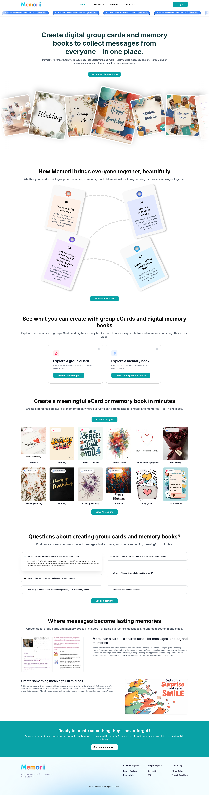
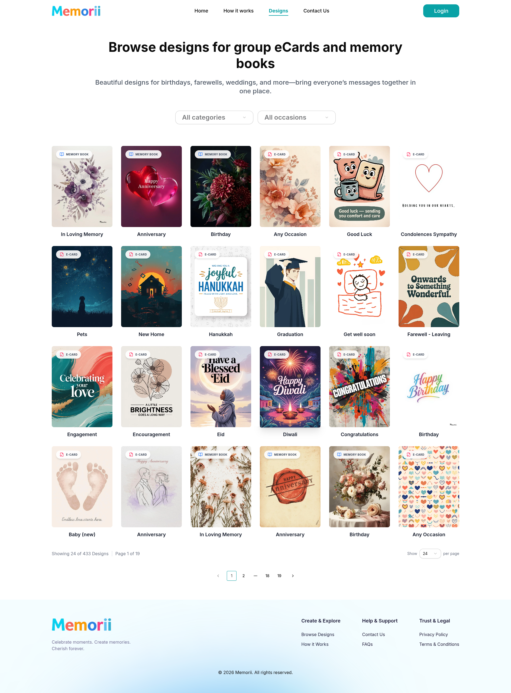
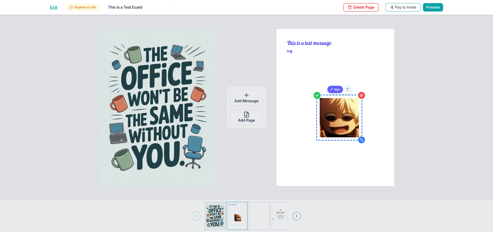
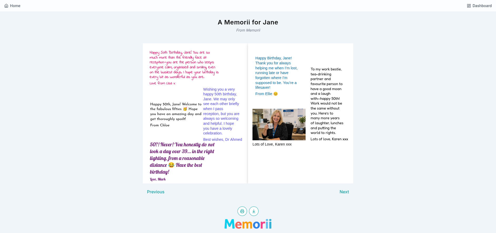
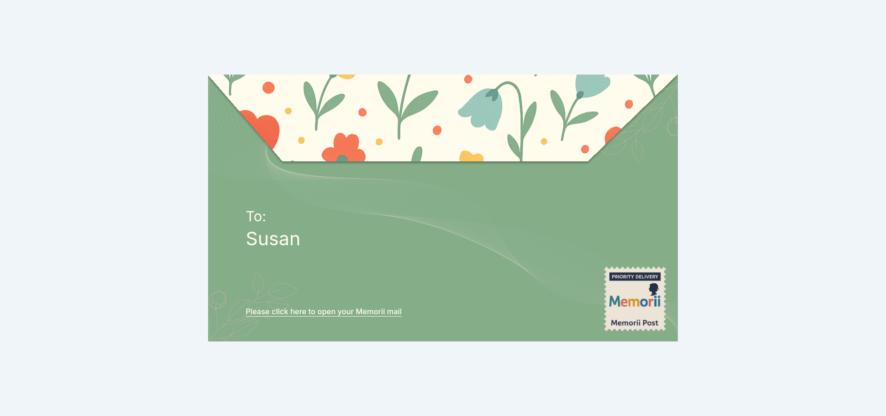

   
  
  
  
  
  
  
  
    

<h1 align="center">🎨 Memorii</h1>

<h3 align="center">
  Digital Group e-Cards & e-Memory Books Platform
</h3>

  

  <i>Celebrate moments. Create memories. Cherish forever.</i>

  A full-featured digital platform for creating, customizing, and sharing collaborative group e-cards and interactive flipbook-style e-memory books — with multi-contributor support, rich canvas editing, and seamless sharing.

 

---

## ✨ Overview

**Memorii** is a modern web application that transforms how people celebrate special occasions together. Unlike traditional single-sender e-cards, Memorii enables **group collaboration** — multiple friends, family members, or colleagues can contribute messages, photos, and memories to a single digital keepsake.

Whether it's a birthday, wedding, retirement, farewell, or memorial, Memorii provides a beautiful, intuitive editor where creators can design and invite others to co-create a lasting digital memory.

### Key Product Highlights

- **Canvas-Based Editor** — A full drag-and-drop editor powered by Fabric.js 6, supporting rich text, images, stickers, layers, undo/redo, and more.
- **Group Collaboration** — Share contributor links so anyone can add their message without needing an account.
- **Interactive Flipbook** — Memory books rendered with realistic page-turning animations via react-pageflip.
- **Professional-Grade UI** — Polished interface built with shadcn/ui, GSAP animations, and smooth Lenis scrolling.
- **PDF Export** — High-resolution A4 PDF downloads with QR codes for printed keepsakes.

 

## 🖼️ Screenshots

  <table>
    <tr>
      <td width="50%" align="center" valign="top">
        <strong>🏠 Landing Page</strong>
         
        
         
        Hero section with marquee, GSAP animations, and call-to-action
      </td>
      <td width="50%" align="center" valign="top">
        <strong>🎨 Template Designs</strong>
         
        
         
        Browse dozens of templates by category & occasion
      </td>
    </tr>
    <tr>
      <td width="50%" align="center" valign="top">
        <strong>✏️ Canvas Editor</strong>
         
        
         
        Fabric.js 6 drag-and-drop editor with text, images & stickers
      </td>
      <td width="50%" align="center" valign="top">
        <strong>🔍 Preview & Send</strong>
         
        
         
        Review, invite contributors, and share your digital keepsake
      </td>
    </tr>
    <tr>
      <td width="50%" align="center" valign="top" colspan="2">
        <strong>📬 Animated Envelope — Received Card</strong>
         
        
         
        Beautiful animated envelope opening experience for card recipients
      </td>
    </tr>
  </table>

 

## 🚀 Key Features

| Area | Features |
|------|----------|
| 🎴 **e-Cards** | Single or multi-page digital cards with rich text, images, stickers, and customizable backgrounds |
| 📖 **e-Memory Books** | Flipbook-style multi-page memory books with grid/vertical layouts, prompts, and guest signatures |
| 👥 **Group Collaboration** | Invite unlimited contributors via unique links — no sign-up required for guests |
| 🎨 **Canvas Editor** | Full Fabric.js 6 drag-and-drop editor with text, images, stickers, layers, undo/redo, copy/paste |
| 🖼️ **Template Library** | Dozens of professionally designed templates organized by category and occasion |
| 🔐 **Authentication** | Email/password auth, Google OAuth, OTP verification, password reset flow |
| 📊 **User Dashboard** | Manage active cards, memory books, drafts, sent items, received items, and account settings |
| 🖨️ **PDF Export** | Download high-resolution A4 PDF with embedded QR codes for physical keepsakes |
| 🔗 **Shareable Links** | Generate unique contributor and recipient links for easy sharing |
| ↩️ **Undo/Redo** | Per-page undo/redo history stacks for a seamless editing experience |
| 🎬 **Flipbook Preview** | Interactive page-flip animation for memory books with realistic corner curl |
| 🎟️ **Coupon System** | Dynamic promotional banners with marquee ribbons and checkout coupons |
| 📱 **Responsive Design** | Fully responsive with mobile-optimized drawers, pagination, and touch-friendly controls |
| ✍️ **Guest Signatures** | Contributors can sign their name on contributions for attribution |
| ❓ **Memory Prompts** | Curated questions that guide contributors to create more personal and meaningful entries |
| 💾 **Auto-Save** | Automatic save with visual status indicator on page changes |

 

## 🛠 Tech Stack

### Frontend & Core Technologies

| Technology | Purpose |
|------------|---------|
| **[Next.js 16](https://nextjs.org/)** | React framework with server-side rendering, routing, and prefetching |
| **[React 19](https://react.dev/)** | UI library with latest concurrent features |
| **[Tailwind CSS v4](https://tailwindcss.com/)** | Utility-first styling and layout structure |
| **[shadcn/ui](https://ui.shadcn.com/)** | Accessible, composable UI components |
| **[Fabric.js 6](http://fabricjs.com/)** | Interactive HTML5 canvas for custom drag-and-drop editing |
| **[Zustand](https://github.com/pmndrs/zustand)** | Lightweight state management with local persistence |
| **[TanStack React Query](https://tanstack.com/query)** | Server state management and caching |
| **[next-auth](https://next-auth.js.org/)** | Secure user authentication and provider integrations |
| **[GSAP](https://gsap.com/) + [Lenis](https://lenis.studiofreight.com/)** | High-performance animations and smooth scrolling effects |
| **[react-pageflip](https://github.com/NinjaDanz3/react-pageflip)** | Interactive page-turning flipbook rendering |
| **[jsPDF](https://github.com/parallax/jsPDF)** | Direct A4 PDF document generation |

 

## 📸 Feature Highlights

### 🎴 e-Card Editor
Create personalized digital greeting cards with:
- **Rich Text** — Dozens of curated Google Fonts (Alex Brush, Montserrat, Playfair Display, Poppins, etc.)
- **Images** — Upload and position images with drag-and-drop simplicity
- **Stickers** — Built-in SVG sticker library with easy search and categorized navigation
- **Layers** — Full layer management with intuitive reordering
- **Backgrounds** — Custom colors and presets per page
- **Multi-Page Support** — Add, delete, and navigate between pages
- **Lock/Unlock** — Prevent accidental edits on finished objects

### 📖 e-Memory Book
Interactive flipbook memory books with:
- **Realistic Page Turning** — Page-flip animations with corner curl interactions
- **Layout Selection** — Choose from multiple structured grid or vertical layouts
- **Memory Prompts** — Pre-written questions guiding contributors to share stories
- **Image Upload Zones** — Dedicated areas for contributor photos and memories
- **Guest Signatures** — Name overlays attributing contributions
- **Full PDF Export** — Complete book export as A4 PDF with QR codes

### 👥 Group Collaboration Workflow
1. **Creator** picks a template, customizes the design, and generates an invite link.
2. **Contributors** click the link and add messages, photos, or answer prompts directly (no sign-up required).
3. **Creator** reviews contributions, arranges pages, and finalizes the book/card.
4. **Recipient** receives the unique link to open a beautifully animated envelope and flip through their keepsake.

 

## 🏆 Project Status
This is a **production-grade application** built with modern engineering standards:
- Modular, component-driven frontend architecture.
- Type-safe data validation and secure user flows.
- Optimized performance for rendering large canvases on desktop and mobile.
- Seamless responsive design optimized for touch and pointer interactions.

 

## 📫 Contact & Demo

  

    <strong>🌐 Visit the live site:</strong>
     
    
  

   
  

    <strong>Built with ❤️ by <a href="https://github.com/ArunRoy404">ArunRoy404</a></strong>
  

   
  

    <i>Next.js 16</i> &bull; <i>React 19</i> &bull; <i>Tailwind CSS v4</i> &bull; <i>Fabric.js 6</i> &bull; <i>Zustand</i> &bull; <i>TanStack Query</i> &bull; <i>shadcn/ui</i>
  

